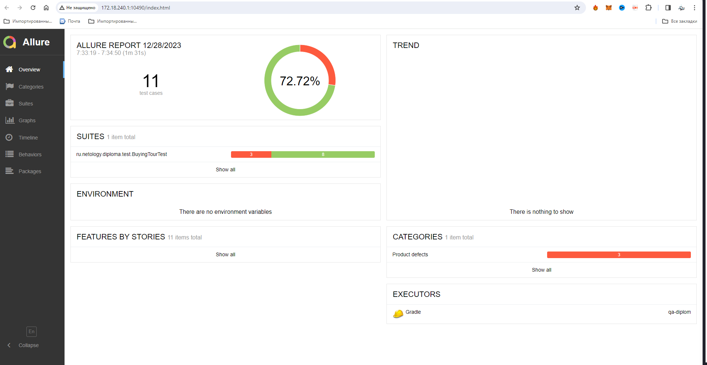
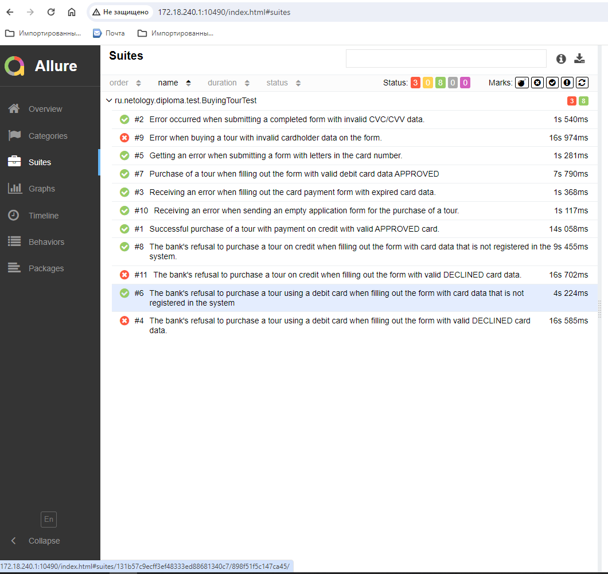

# Отчёт о проведённом тестировании
Проведено тестирование приложения — веб-сервиса, который предлагает купить тур по определённой цене двумя способами:
Обычная оплата по дебетовой карте и за счет выдачи кредита по данным банковской карты.

Автотестами проверено 11 тест-кейсов.

**Результат тестирования:** 72,72 % кейсов пройдены успешно.

Выявленные дефекты со скриншотами и описанием оформлены в issue:

https://github.com/ShestakovaElenaA/qa-diplom/issues/1

https://github.com/ShestakovaElenaA/qa-diplom/issues/2

https://github.com/ShestakovaElenaA/qa-diplom/issues/3

https://github.com/ShestakovaElenaA/qa-diplom/issues/4

https://github.com/ShestakovaElenaA/qa-diplom/issues/5

https://github.com/ShestakovaElenaA/qa-diplom/issues/6

https://github.com/ShestakovaElenaA/qa-diplom/issues/7

https://github.com/ShestakovaElenaA/qa-diplom/issues/8

https://github.com/ShestakovaElenaA/qa-diplom/issues/9

**Общие рекомендации**:

Добавить тестовые метки для упрощения написания селекторов при написании автотестов.

Сделать одинаковый текст ошибки при не заполненных полях - "Поле обязательно к заполнению" вместо "Неверный формат".

Исправление дефектов, найденных при тестировании.